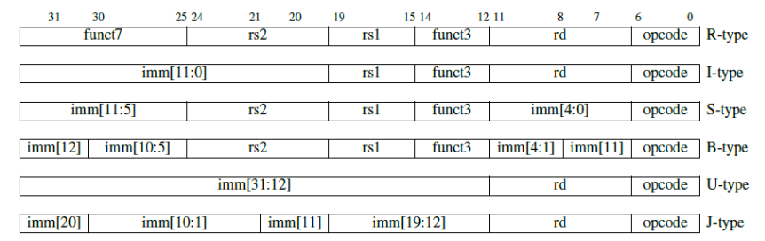
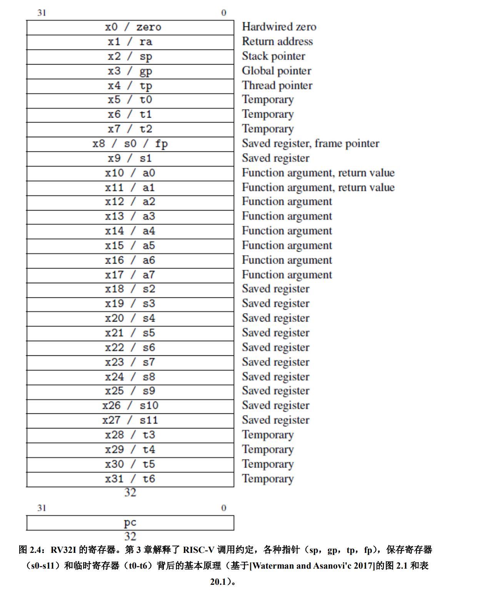
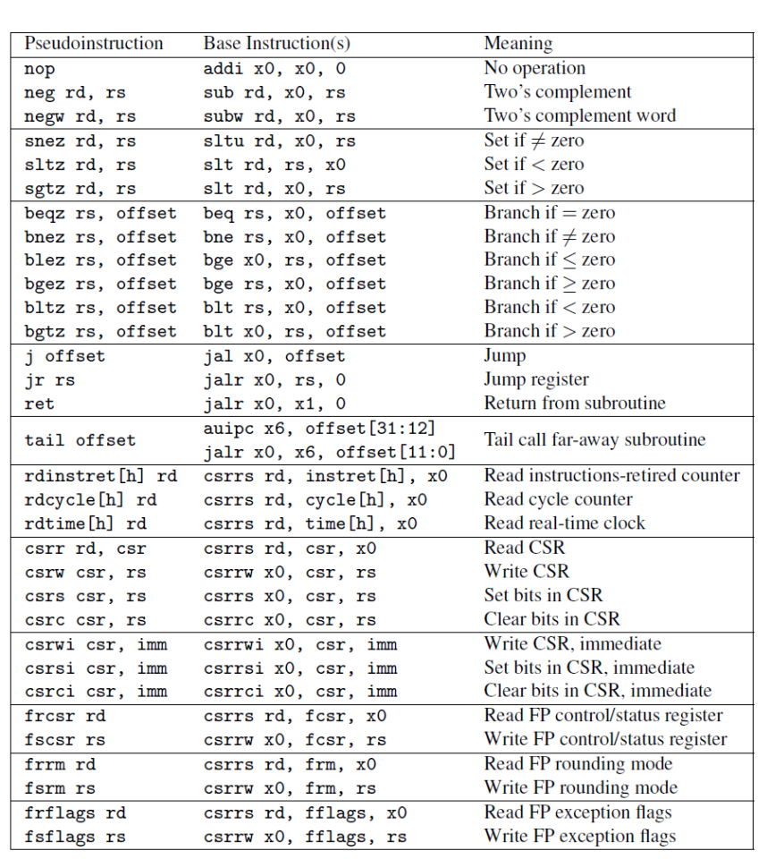
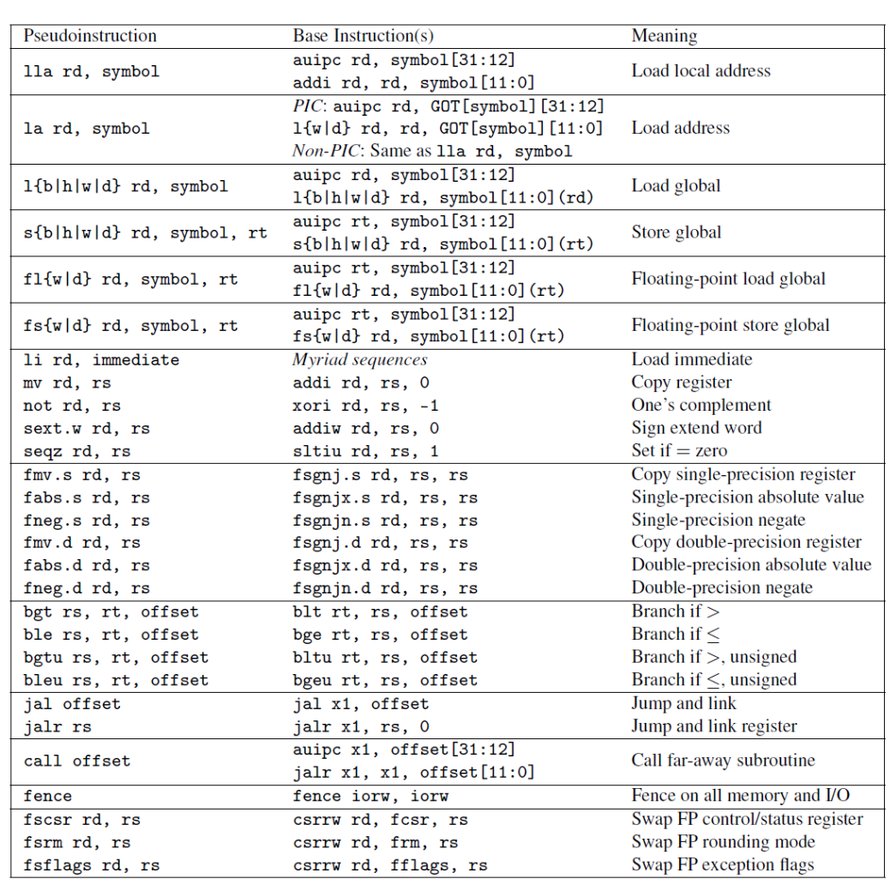
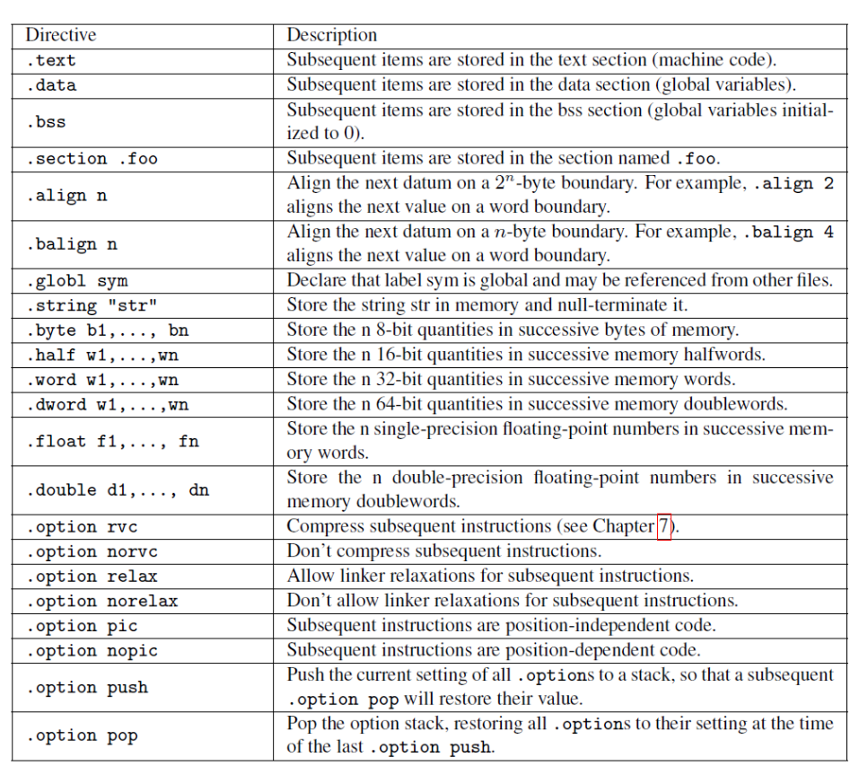
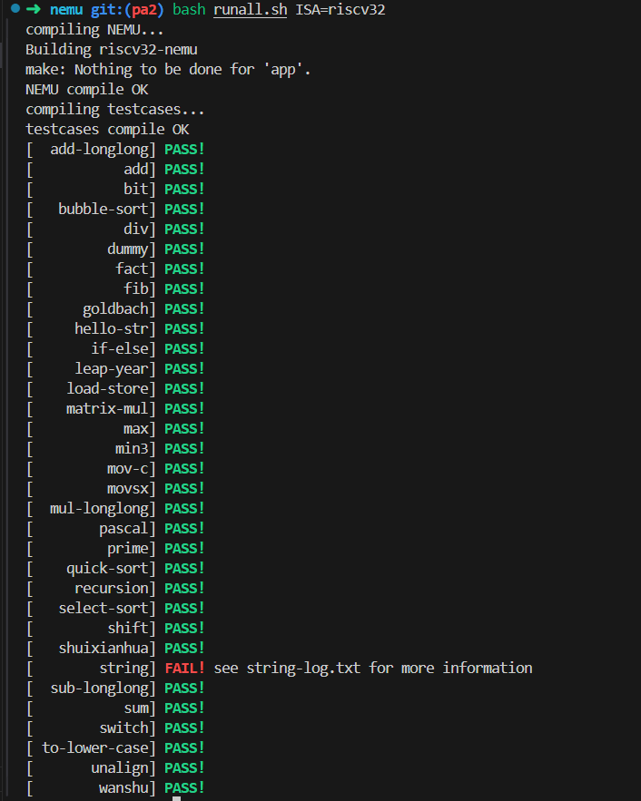

## pa2

### 阅读手册


查看手册，发现RV32I只有6种基本的指令，分别是U型指令，I型指令，J型指令，B型指令，R型指令，S型指令；对应的功能是：
1. U型指令：用于长立即数的U型指令
2. I型指令：用于短立即数和访存load的I型指令
3. J型指令：用于无条件跳转的J型指令
4. B型指令：用于条件跳转的B型指令
5. R型指令：用于寄存器和寄存器之间操作的R类型指令
6. S型指令：用于访存store的S型指令

所有指令的长度是32位长度。指令提供三个寄存器操作数。所有指令编码中，要读写的寄存器标识位置是固定的，在解码指令之前，就可以开始访问寄存器。立即数字段总是符号扩展，符号位总是在指令中的最高位，这意味着可能成为关键路径的立即数符号扩展可以在指令解码之前进行。

指令格式类型，对应的指令编码的位置：


可以看到，B类型和S类型是一样的，J类型和U类型是一样的，就是对于字段的解释不一样。所以，也可以认为是4种类型。

全0的指令码和全1的指令码都是非法指令，这个可以方便程序员调试。

**RV32I整数指令概述**

算术指令：add, sub

逻辑指令：add, or, xor

移位指令：sll, srl, sra

上述指令还有立即数的版本，立即数总是进行符号扩展.

程序可以根据比较结果生成布尔值。slt和sltu，也有立即数版本，slti, sltiu。（带u后缀的为无符号版本）

加载立即数到高位lui将20位常量加载到寄存器的高20位，接着可以使用标准的立即指令来创建32位常量。

auipc指令将立即数左移12位加到PC上。这样，可以将auipc中的20位立即数与jalr中的12位立即数组合，将执行流程转移到任何32位pc相对地址。而auipc加上普通加载或存储指令中的12位立即数偏移量，可以使得程序访问任何32位PC相对地址的数据。

**RV32I的寄存器**

一共32个寄存器，x0到x31，其中x0总是0。

寄存器有别名，别名可以帮助记忆关于调用惯例方面的规范。

下面是寄存器及其别名的对应关系：



还有一个是PC寄存器，该寄存器不属于通用寄存器，指向当前正在执行的指令的内存地址。

这里是别名的分类：zero, ra, sp, gp, tp, t0-t6, s0-s11, fp(s0), a0-a7。这里的别名在考虑到RISC-V上面执行过程调用惯例的时候会有意义，包括如何放置参数，如何放置返回值，哪些是调用者保存的，哪些是被调用者保存的等。对于底层的硬件来说，这些寄存器除了x0之外没有任何区别。


**RV32I的Load和Store**

lw (32bits)
sw
lb (8bits)
lbu
lh (16bits)
lhu

加载和存储支持的唯一的寻址模式是符号扩展12位立即数加上基地址寄存器。RISC-V使用的是小端机结构。

**R32I的条件分支**

beq
bne
bge
bgeu
blt
bltu

由于RISC-V指令长度必须是两个字节的倍数，分支指令的寻址方式是12位的立即数乘以2，符号扩展，然后加到PC上作为分支的跳转地址。

RISCV指令中没有条件码。

**无条件跳转**

jal将下一条指令PC+4的地址保存到目标寄存器中，通常是返回地址寄存器ra。如果使用x0来替换ra，则可以实现无条件跳转，因为x0不能被更改。

jalr可以调用地址是动态计算出来的函数，或者也可以实现调用返回（ra作为源寄存器，x0作为目标寄存器）。

**伪指令：不是真的机器指令，会被汇编器翻译为真实的物理指令。**

例如： ret 被汇编为：jalr x0, x1, 0

下表给出了一系列伪指令及其依赖的真实的处理器物理指令（这些伪指令都依赖于x0寄存器，从中可以看到x0寄存器的作用）。


下表是另外一些伪指令及其被汇编之后的物理指令：



下面是汇编器的指示符 assemble directives，可以在汇编语言的源代码中看到，了解这些指示符可以帮助理解汇编语言编写的程序。

.text 进入代码段

.aligh 2 后续代码按照2\^2字节对齐

.global main 声明全局符号main

.section .rodata 进入只读数据段

.balign 4 数据段安装4字节对齐

.string "hello, %s!\n" 创建空字符结尾的字符串




### dummy.c

查看反汇编代码
```
Disassembly of section .text:

80100000 <_start>:
80100000:	00000413          	li	s0,0
80100004:	00009117          	auipc	sp,0x9
80100008:	ffc10113          	addi	sp,sp,-4 # 80109000 <_end>
8010000c:	00c000ef          	jal	ra,80100018 <_trm_init>

Disassembly of section .text.startup:

80100010 <main>:
80100010:	00000513          	li	a0,0
80100014:	00008067          	ret

Disassembly of section .text._trm_init:

80100018 <_trm_init>:
80100018:	80000537          	lui	a0,0x80000
8010001c:	ff010113          	addi	sp,sp,-16
80100020:	00050513          	mv	a0,a0
80100024:	00112623          	sw	ra,12(sp)
80100028:	fe9ff0ef          	jal	ra,80100010 <main>
8010002c:	00050513          	mv	a0,a0
80100030:	0000006b          	0x6b
80100034:	0000006f          	j	80100034 <_trm_init+0x1c>

```

我们需要实现li，auipc，addi，jal，ret，lui，mv，sw，j等指令。

继续查看手册，我们可以发现 li 指令是 lui 和 addi 指令的组合，因此不需 要单独实现；最后的 ret 指令是伪指令，其实需要实现的是 jalr；mv 指令也是伪 指令，会被扩展成 addi rd, rs1, 0，不需要单独实现。那么我们在本部分只需要实 现 li、auipc、addi、jal、jalr 即可。

首先可以实现全部译码的程序

```c
#include "cpu/decode.h"

#include "rtl/rtl.h"

  

// decode operand helper

#define make_DopHelper(name) void concat(decode_op_, name) (Operand *op, uint32_t val, bool load_val)

  

static inline make_DopHelper(i) {
  op->type = OP_TYPE_IMM;
  op->imm = val;
  rtl_li(&op->val, op->imm);
  print_Dop(op->str, OP_STR_SIZE, "%d", op->imm);
}

static inline make_DopHelper(r) {
  op->type = OP_TYPE_REG;
  op->reg = val;
  if (load_val) {
    rtl_lr(&op->val, op->reg, 4);
  }
  print_Dop(op->str, OP_STR_SIZE, "%s", reg_name(op->reg, 4));
}

make_DHelper(U) {
  decode_op_i(id_src, decinfo.isa.instr.imm31_12 << 12, true);
  decode_op_r(id_dest, decinfo.isa.instr.rd, false);
  print_Dop(id_src->str, OP_STR_SIZE, "0x%x", decinfo.isa.instr.imm31_12);
}

make_DHelper(I){
  decode_op_r(id_src, decinfo.isa.instr.rs1, true);
  decode_op_i(id_src2, decinfo.isa.instr.simm11_0, true);
  print_Dop(id_src->str, OP_STR_SIZE, "0x%x", decinfo.isa.instr.rs1);
  print_Dop(id_src2->str, OP_STR_SIZE, "0x%x", decinfo.isa.instr.simm11_0);
  decode_op_r(id_dest, decinfo.isa.instr.rd, false);
}

make_DHelper(J){
  int32_t offset =
      (decinfo.isa.instr.simm20 << 20) | (decinfo.isa.instr.imm19_12 << 12) |
      (decinfo.isa.instr.imm11_ << 11) | (decinfo.isa.instr.imm10_1 << 1);
  decode_op_i(id_src, offset, true);
  print_Dop(id_src->str, OP_STR_SIZE, "0x%x", offset);
  decode_op_r(id_dest, decinfo.isa.instr.rd, false);
}

make_DHelper(B){
  decode_op_r(id_src, decinfo.isa.instr.rs1, true);
  decode_op_r(id_src2, decinfo.isa.instr.rs2, true);
  print_Dop(id_src->str, OP_STR_SIZE, "0x%x", decinfo.isa.instr.rs1);
  print_Dop(id_src2->str, OP_STR_SIZE, "0x%x", decinfo.isa.instr.rs2);
  int32_t offset =
      (decinfo.isa.instr.simm12 << 12) | (decinfo.isa.instr.imm11 << 11) |
      (decinfo.isa.instr.imm10_5 << 5) | (decinfo.isa.instr.imm4_1 << 1);
  decode_op_i(id_dest, offset, true);
}

  

make_DHelper(R){
  decode_op_r(id_src, decinfo.isa.instr.rs1, true);
  decode_op_r(id_src2, decinfo.isa.instr.rs2, true);
  print_Dop(id_src->str, OP_STR_SIZE, "0x%x", decinfo.isa.instr.rs1);
  print_Dop(id_src2->str, OP_STR_SIZE, "0x%x", decinfo.isa.instr.rs2);
  decode_op_r(id_dest,decinfo.isa.instr.rd,false);
}

make_DHelper(ld) {
  decode_op_r(id_src, decinfo.isa.instr.rs1, true);
  decode_op_i(id_src2, decinfo.isa.instr.simm11_0, true);
  print_Dop(id_src->str, OP_STR_SIZE, "%d(%s)", id_src2->val, reg_name(id_src->reg, 4));
  rtl_add(&id_src->addr, &id_src->val, &id_src2->val);
  decode_op_r(id_dest, decinfo.isa.instr.rd, false);
}

  
make_DHelper(st) {
  decode_op_r(id_src, decinfo.isa.instr.rs1, true);
  int32_t simm = (decinfo.isa.instr.simm11_5 << 5) | decinfo.isa.instr.imm4_0;
  decode_op_i(id_src2, simm, true);
  print_Dop(id_src->str, OP_STR_SIZE, "%d(%s)", id_src2->val, reg_name(id_src->reg, 4));
  rtl_add(&id_src->addr, &id_src->val, &id_src2->val);
  decode_op_r(id_dest, decinfo.isa.instr.rs2, true);
}
```

然后填写op_code_table完成执行部分的代码

```c
#include "cpu/exec.h"

make_EHelper(lui) {
  rtl_sr(id_dest->reg, &id_src->val, 4);

  print_asm_template2(lui);
}

make_EHelper(auipc){
  rtl_add(&id_dest->val, &cpu.pc, &id_src->val);
  rtl_sr(id_dest->reg, &id_dest->val, 4);

  print_asm_template2(auipc);
}


make_EHelper(imm){
  switch(decinfo.isa.instr.funct3){
    case 0:                                              // addi
      rtl_add(&id_dest->val, &id_src->val, &id_src2->val);
      rtl_sr(id_dest->reg, &id_dest->val, 4);
      print_asm_template2(addi);
      break;
    case 1:                                               //slli
      rtl_shl(&id_dest->val, &id_src->val, &id_src2->reg);
      rtl_sr(id_dest->reg, &id_dest->val, 4);
      print_asm_template2(slli);
      break;
    case 2:                                                 //slti
      id_dest->val = (signed)id_src->val < (signed)id_src2->val;
      rtl_sr(id_dest->reg, &id_dest->val, 4);
      print_asm_template2(slti);
      break;
    case 3:                                              //sltiu
      id_dest->val = (unsigned)id_src->val < (unsigned)id_src2->val;
      rtl_sr(id_dest->reg, &id_dest->val, 4);
      print_asm_template2(sltiu);
      break;
    case 4:                                              //xori
      rtl_xor(&id_dest->val, &id_src->val, &id_src2->val);
      rtl_sr(id_dest->reg, &id_dest->val, 4);
      print_asm_template2(xori);
      break;
    case 5:                                             // srli&&srai
      if (decinfo.isa.instr.funct7 == 0b0000000) {    // srli
        rtl_shr(&id_dest->val,&id_src->val,&id_src2->reg);
        rtl_sr(id_dest->reg,&id_dest->val,4);
        print_asm_template2(srli);
      } else if (decinfo.isa.instr.funct7 == 0b0100000) {  // srai
        rtl_sar(&id_dest->val, &id_src->val, &id_src2->reg);
        rtl_sr(id_dest->reg, &id_dest->val, 4);
        print_asm_template2(srai);
      }
      break;
    case 6:                                               // ori
      rtl_or(&id_dest->val, &id_src->val, &id_src2->val);
      rtl_sr(id_dest->reg, &id_dest->val, 4);
      print_asm_template2(ori);
      break;
    case 7:                                             // andi
      rtl_and(&id_dest->val, &id_src->val, &id_src2->val);
      rtl_sr(id_dest->reg, &id_dest->val, 4);
      print_asm_template2(andi);
      break;
  }
}


make_EHelper(reg){
  switch (decinfo.isa.instr.funct3) {
    case 0:                                       // add  &&  sub  &&  mul
      if (decinfo.isa.instr.funct7 == 0b0000000) {        // add
        rtl_add(&id_dest->val, &id_src->val, &id_src2->val);
        rtl_sr(id_dest->reg, &id_dest->val, 4);
        print_asm_template3(add);
      } else if (decinfo.isa.instr.funct7 == 0b0100000) {  // sub
        rtl_sub(&id_dest->val, &id_src->val, &id_src2->val);
        rtl_sr(id_dest->reg, &id_dest->val, 4);
        print_asm_template3(sub);
      } else if (decinfo.isa.instr.funct7 == 0b0000001) {  // mul
        rtl_imul_lo(&id_dest->val, &id_src->val, &id_src2->val);
        rtl_sr(id_dest->reg, &id_dest->val, 4);
        print_asm_template3(mul);
      }
      break;
    case 1:                                             // sll&&mulh
      if (decinfo.isa.instr.funct7 == 0b0000000) {        // sll
        rtl_shl(&id_dest->val, &id_src->val, &id_src2->val);
        rtl_sr(id_dest->reg, &id_dest->val, 4);
        print_asm_template3(sll);
      } else if (decinfo.isa.instr.funct7 == 0b0000001) {  // mulh
        rtl_imul_hi(&id_dest->val, &id_src->val, &id_src2->val);
        rtl_sr(id_dest->reg, &id_dest->val, 4);
        print_asm_template3(mulh);
      }
      break;
    case 2:                                                  // slt
      id_dest->val = (signed)id_src->val < (signed)id_src2->val;
      rtl_sr(id_dest->reg, &id_dest->val, 4);
      print_asm_template3(slt);
      break;
    case 3:                                               // sltu
      id_dest->val = (unsigned)id_src->val < (unsigned)id_src2->val;
      rtl_sr(id_dest->reg, &id_dest->val, 4);
      print_asm_template3(sltu);
      break;
    case 4:                                              // xor&&div
      if (decinfo.isa.instr.funct7 == 0b0000000) {          // xor
        rtl_xor(&id_dest->val, &id_src->val, &id_src2->val);
        rtl_sr(id_dest->reg, &id_dest->val, 4);
        print_asm_template3(xor);
      } else if (decinfo.isa.instr.funct7 == 0b0000001) {   // div
        rtl_idiv_q(&id_dest->val, &id_src->val, &id_src2->val);
        rtl_sr(id_dest->reg, &id_dest->val, 4);
        print_asm_template3(div);
      }
      break;
    case 5:                                           // srl&&sra&&divu
      if (decinfo.isa.instr.funct7 == 0b0000000) {    // srl
        rtl_shr(&id_dest->val, &id_src->val, &id_src2->val);
        rtl_sr(id_dest->reg, &id_dest->val, 4);
        print_asm_template2(srl);
      } else if (decinfo.isa.instr.funct7 == 0b0100000) {  // sra
        rtl_sar(&id_dest->val, &id_src->val, &id_src2->val);
        rtl_sr(id_dest->reg, &id_dest->val, 4);
        print_asm_template2(sra);
      } else if (decinfo.isa.instr.funct7 == 0b0000001) {  // divu
        rtl_div_q(&id_dest->val, &id_src->val, &id_src2->val);
        rtl_sr(id_dest->reg, &id_dest->val, 4);
        print_asm_template3(divu);
      }
      break;
    case 6:                                         // or&&rem
      if (decinfo.isa.instr.funct7 == 0b0000000) {  // or
        rtl_or(&id_dest->val, &id_src->val, &id_src2->val);
        rtl_sr(id_dest->reg, &id_dest->val, 4);
        print_asm_template3(or);
      } else if (decinfo.isa.instr.funct7 == 0b0000001) {  // rem
        rtl_idiv_r(&id_dest->val, &id_src->val, &id_src2->val);
        rtl_sr(id_dest->reg, &id_dest->val, 4);
        print_asm_template3(rem);
      }
      break;
    case 7:                                        // and&&remu
      if (decinfo.isa.instr.funct7 == 0b0000000) {  // and
        rtl_and(&id_dest->val, &id_src->val, &id_src2->val);
        rtl_sr(id_dest->reg, &id_dest->val, 4);
        print_asm_template3(and);
      } else if (decinfo.isa.instr.funct7 == 0b0000001) {  // remu
        rtl_div_r(&id_dest->val, &id_src->val, &id_src2->val);
        rtl_sr(id_dest->reg, &id_dest->val, 4);
        print_asm_template3(remu);
      }
      break;
  }
}
```


```c
#include "cpu/exec.h"


make_EHelper(jal) {
  uint32_t addr = cpu.pc + 4;
  rtl_sr(id_dest->reg, &addr, 4);
  rtl_add(&decinfo.jmp_pc, &cpu.pc, &id_src->val);
  rtl_j(decinfo.jmp_pc);

  print_asm_template2(jal);
}

make_EHelper(jalr){
  uint32_t addr = cpu.pc + 4;
  rtl_sr(id_dest->reg, &addr, 4);
  decinfo.jmp_pc = (id_src->val + id_src2->val) & ~1;
  rtl_j(decinfo.jmp_pc);

  difftest_skip_dut(1, 2);  // difftest

  print_asm_template2(jalr);
}


make_EHelper(branch){
  decinfo.jmp_pc = cpu.pc + id_dest->val;
  switch (decinfo.isa.instr.funct3) {
    case 0:                                                            // beq
      rtl_jrelop(RELOP_EQ, &id_src->val, &id_src2->val, decinfo.jmp_pc);
      print_asm_template2(beq);
      break;
    case 1:                                                            // bne
      rtl_jrelop(RELOP_NE, &id_src->val, &id_src2->val, decinfo.jmp_pc);
      print_asm_template2(bne);
      break;
    case 4:                                                            // blt
      rtl_jrelop(RELOP_LT, &id_src->val, &id_src2->val, decinfo.jmp_pc);
      print_asm_template2(blt);
      break;
    case 5:                                                           // bge
      rtl_jrelop(RELOP_GE, &id_src->val, &id_src2->val, decinfo.jmp_pc);
      print_asm_template2(bge);
      break;
    case 6:                                                           // bltu
      rtl_jrelop(RELOP_LTU, &id_src->val, &id_src2->val, decinfo.jmp_pc);
      print_asm_template2(bltu);
      break;
    case 7:                                                           // bgeu
      rtl_jrelop(RELOP_GEU, &id_src->val, &id_src2->val, decinfo.jmp_pc);
      print_asm_template2(bgeu);
      break;
  }
}

```


```c
#include "cpu/exec.h"
#include "all-instr.h"

static OpcodeEntry load_table [8] = {
  EX(lb), EX(lh), EXW(ld, 4), EMPTY, EXW(ld,1), EXW(ld,2), EMPTY, EMPTY
};

static make_EHelper(load) {
  decinfo.width = load_table[decinfo.isa.instr.funct3].width;
  idex(pc, &load_table[decinfo.isa.instr.funct3]);
}

static OpcodeEntry store_table [8] = {
  EXW(st,1), EXW(st,2), EXW(st, 4), EMPTY, EMPTY, EMPTY, EMPTY, EMPTY
};

static make_EHelper(store) {
  decinfo.width = store_table[decinfo.isa.instr.funct3].width;
  idex(pc, &store_table[decinfo.isa.instr.funct3]);
}

static OpcodeEntry opcode_table [32] = {
  /* b00 */ IDEX(ld, load), EMPTY, EMPTY, EMPTY, IDEX(I, imm), IDEX(U, auipc), EMPTY, EMPTY,
  /* b01 */ IDEX(st, store), EMPTY, EMPTY, EMPTY, IDEX(R, reg), IDEX(U, lui), EMPTY, EMPTY,
  /* b10 */ EMPTY, EMPTY, EMPTY, EMPTY, EMPTY, EMPTY, EMPTY, EMPTY,
  /* b11 */ IDEX(B, branch), IDEX(I, jalr), EX(nemu_trap), IDEX(J, jal), EMPTY, EMPTY, EMPTY, EMPTY,
};

void isa_exec(vaddr_t *pc) {
  decinfo.isa.instr.val = instr_fetch(pc, 4);
  assert(decinfo.isa.instr.opcode1_0 == 0x3);
  idex(pc, &opcode_table[decinfo.isa.instr.opcode6_2]);
}

```


```c
#include "cpu/exec.h"

make_EHelper(ld) {
  rtl_lm(&s0, &id_src->addr, decinfo.width);
  rtl_sr(id_dest->reg, &s0, 4);

  switch (decinfo.width) {
    case 4: print_asm_template2(lw); break;
    case 2: print_asm_template2(lhu); break;
    case 1: print_asm_template2(lbu); break;
    default: assert(0);
  }
}

make_EHelper(st) {
  rtl_sm(&id_src->addr, &id_dest->val, decinfo.width);

  switch (decinfo.width) {
    case 4: print_asm_template2(sw); break;
    case 2: print_asm_template2(sh); break;
    case 1: print_asm_template2(sb); break;
    default: assert(0);
  }
}

make_EHelper(lh){
  rtl_lm(&s0, &id_src->addr, 2);
  rtl_sext(&s1, &s0, 2);
  rtl_sr(id_dest->reg, &s1, 4);
  print_asm_template2(lh);
}

make_EHelper(lb){
  rtl_lm(&s0, &id_src->addr, 1);
  rtl_sext(&s1, &s0, 1);
  rtl_sr(id_dest->reg, &s1, 4);
  print_asm_template2(lb);
}

```


填写opcode_table如下

```c
#include "cpu/exec.h"
#include "all-instr.h"

static OpcodeEntry load_table [8] = {
  EX(lb), EX(lh), EXW(ld, 4), EMPTY, EXW(ld,1), EXW(ld,2), EMPTY, EMPTY
};

static make_EHelper(load) {
  decinfo.width = load_table[decinfo.isa.instr.funct3].width;
  idex(pc, &load_table[decinfo.isa.instr.funct3]);
}

static OpcodeEntry store_table [8] = {
  EXW(st,1), EXW(st,2), EXW(st, 4), EMPTY, EMPTY, EMPTY, EMPTY, EMPTY
};

static make_EHelper(store) {
  decinfo.width = store_table[decinfo.isa.instr.funct3].width;
  idex(pc, &store_table[decinfo.isa.instr.funct3]);
}

static OpcodeEntry opcode_table [32] = {
  /* b00 */ IDEX(ld, load), EMPTY, EMPTY, EMPTY, IDEX(I, imm), IDEX(U, auipc), EMPTY, EMPTY,
  /* b01 */ IDEX(st, store), EMPTY, EMPTY, EMPTY, IDEX(R, reg), IDEX(U, lui), EMPTY, EMPTY,
  /* b10 */ EMPTY, EMPTY, EMPTY, EMPTY, EMPTY, EMPTY, EMPTY, EMPTY,
  /* b11 */ IDEX(B, branch), IDEX(I, jalr), EX(nemu_trap), IDEX(J, jal), EMPTY, EMPTY, EMPTY, EMPTY,
};

void isa_exec(vaddr_t *pc) {
  decinfo.isa.instr.val = instr_fetch(pc, 4);
  assert(decinfo.isa.instr.opcode1_0 == 0x3);
  idex(pc, &opcode_table[decinfo.isa.instr.opcode6_2]);
}

```


要完成ld-store还要完成rtl-sext 即寄存器扩展指令
```c
static inline void rtl_sext(rtlreg_t* dest, const rtlreg_t* src1, int width) {
  // dest <- signext(src1[(width * 8 - 1) .. 0])
  // TODO();
  int32_t temp = *src1;
  switch(width) {
    case 4: *dest = *src1; return;
    case 3: temp = temp <<  8; *dest = temp >>  8; return; 
    case 2: temp = temp << 16; *dest = temp >> 16; return; 
    case 1: temp = temp << 24; *dest = temp >> 24; return;
    default: assert(0);
  }
}
```




完成所有指令后就差string测试无法通过。需要实现有关string的一系列函数。

### string

最后完成string.c中的一系列函数

```c
#include "klib.h"

#if !defined(__ISA_NATIVE__) || defined(__NATIVE_USE_KLIB__)

size_t strlen(const char *s) {
  size_t i = 0;
  while (s[i]) i++;
  return i;
}

char *strcpy(char* dst,const char* src) {
  size_t i = 0;
  while (src[i] != '\0') {
    dst[i]=src[i];
    i++;
  }
  dst[i] = '\0';
  return dst;
}

char* strncpy(char* dst, const char* src, size_t n) {
  for (size_t i = 0; src[i] != '\0' && i < n;i++){
    dst[i] = src[i];
  }
  return dst;
}

char* strcat(char* dst, const char* src) {
  size_t i = 0;
  while (dst[i] != '\0') i++;
  size_t j = 0;
  while(src[j]!='\0'){
    dst[i + j] = src[j];
    j++;
  }
  dst[i + j] = '\0';
  return dst;
}

int strcmp(const char* s1, const char* s2) {
  size_t i = 0;
  while (s1[i] != '\0' && s1[i] == s2[i]) i++;
  return s1[i] - s2[i];
}

int strncmp(const char* s1, const char* s2, size_t n) {
  size_t i = 0;
  while (s1[i] != '\0' && i < n && s1[i] == s2[i]) i++;
  if (i == n) return 0;
  return s1[i] - s2[i];
}

void* memset(void* v,int c,size_t n) {
  char* temp = v;
  for (int i = 0; i < n; i++) {
    temp[i] = (char)c;
  }
  return v;
}

void* memcpy(void* out, const void* in, size_t n) {
  char* temp = out;
  for (int i = 0; i < n; i++) {
    temp[i] = ((char*)in)[i];
  }
  return out;
}

int memcmp(const void* s1, const void* s2, size_t n){
  const char* temp1 = s1;
  const char* temp2 = s2;
  for (int i = 0; i < n; i++) {
    if (temp1[i] != temp2[i]) return temp1[i] - temp2[i];
  }
  return 0;
}

#endif
```

最后完成printf的函数即可

```c

int vsprintf(char *out, const char *fmt, va_list ap) {
  char *temp = out;
  while (*fmt != '\0') {
    if(*fmt!='%'){
      *temp++ = *fmt++;
    } else {
      fmt++;
      switch(*fmt){
        case 's':{
          char *str = va_arg(ap, char *);
          while (*str != '\0') {
            *temp++ = *str++;
          }
          break;
        }
        case 'd':{
          int n = va_arg(ap, int);
          if (n == 0) {
            *temp++ = '0';
            break;
          }
          if(n<0){
            *temp++ = '-';
            n = -n;
          }
          char buf[11];
          int i = 0;
          while(n!=0){
            buf[i++] = n % 10 + '0';
            n = n / 10;
          }
          for (int j = i - 1; j >= 0; j--) {
            *temp++ = buf[j];
          }
          break;
        }
        case 'x':{
          int n = va_arg(ap, int);
          if (n == 0) {
            *temp++ = '0';
            *temp++ = 'x';
            *temp++ = '0';
            break;
          }
          if(n<0){
            *temp++ = '-';
            n = -n;
          }
          char buf[12];
          int i = 0;
          while(n!=0){
            int a = n % 16;
            if (a < 10)
              buf[i++] = a + '0';
            else
              buf[i++] = a - 10 + 'a';
            n = n / 16;
          }
          *temp++ = '0';
          *temp++ = 'x';
          for (int j = i - 1; j >= 0; j--) {
            *temp++ = buf[j];
          }
          break;
        }
      }
      fmt++;
    }
  }
  *temp='\0';
  return temp - out;
}

int sprintf(char *out, const char *fmt, ...) {
  va_list ap;
  va_start(ap, fmt);
  int length = vsprintf(out, fmt, ap);
  va_end(ap);
  return length;
}
```

### io

io部分不在赘述

#### 输出

```c

int printf(const char *fmt, ...) {
  char buf[1000];
  va_list ap;
  va_start(ap, fmt);
  int length = vsprintf(buf, fmt, ap);
  va_end(ap);
  int i = 0;
  while (buf[i] != '\0') {
    _putc(buf[i]);
    i++;
  }
  return length;
}

```


#### 键盘输入

```c

size_t __am_input_read(uintptr_t reg, void *buf, size_t size) {
  switch (reg) {
    case _DEVREG_INPUT_KBD: {
      _DEV_INPUT_KBD_t *kbd = (_DEV_INPUT_KBD_t *)buf;
      int key = inl(KBD_ADDR);
      kbd->keydown = (key & KEYDOWN_MASK) ? 1 : 0;
      kbd->keycode = key;
      return sizeof(_DEV_INPUT_KBD_t);
    }
  }
  return 0;
}
```


#### 时钟

```c

static uint32_t start_time;

size_t __am_timer_read(uintptr_t reg, void *buf, size_t size) {
  switch (reg) {
    case _DEVREG_TIMER_UPTIME: {
      _DEV_TIMER_UPTIME_t *uptime = (_DEV_TIMER_UPTIME_t *)buf;
      uint32_t cur_time = inl(RTC_ADDR);
      uptime->hi = 0;
      uptime->lo = cur_time - start_time;
      return sizeof(_DEV_TIMER_UPTIME_t);
    }
    case _DEVREG_TIMER_DATE: {
      _DEV_TIMER_DATE_t *rtc = (_DEV_TIMER_DATE_t *)buf;
      rtc->second = 0;
      rtc->minute = 0;
      rtc->hour   = 0;
      rtc->day    = 0;
      rtc->month  = 0;
      rtc->year   = 2000;
      return sizeof(_DEV_TIMER_DATE_t);
    }
  }
  return 0;
}

void __am_timer_init() { 
  start_time = inl(RTC_ADDR); 
}
```


#### vga

```c

size_t __am_video_read(uintptr_t reg, void *buf, size_t size) {
  switch (reg) {
    case _DEVREG_VIDEO_INFO: {
      _DEV_VIDEO_INFO_t *info = (_DEV_VIDEO_INFO_t *)buf;
      info->width = 400;
      info->height = 300;
      return sizeof(_DEV_VIDEO_INFO_t);
    }
  }
  return 0;
}

size_t __am_video_write(uintptr_t reg, void *buf, size_t size) {
  switch (reg) {
    case _DEVREG_VIDEO_FBCTL: {
      _DEV_VIDEO_FBCTL_t *ctl = (_DEV_VIDEO_FBCTL_t *)buf;
      int x = ctl->x, y = ctl->y, h = ctl->h, w = ctl->w;
      int W = screen_width();
      int H = screen_height();
      uint32_t *pixels = ctl->pixels;
      uint32_t *fb = (uint32_t *)(uintptr_t)FB_ADDR;
      for (int i = 0; i < h; i++) {
        for (int j = 0; j < w; j++) {
          fb[(y + i) * W + x + j] = pixels[i * w + j];
        }
      }
      if (ctl->sync) {
        outl(SYNC_ADDR, 0);
      }
      return size;
    }
  }
  return 0;
}

void __am_vga_init() {
  int i;
  int size = screen_width() * screen_height();
  uint32_t *fb = (uint32_t *)(uintptr_t)FB_ADDR;
  for (i = 0; i < size; i ++) fb[i] = 0;
  draw_sync();
}
```

vga这部分完成后在运行测试时无法通过，查看代码发现时vga中有个函数还未实现`TODO`

```c

static void vga_io_handler(uint32_t offset, int len, bool is_write) {
  // TODO: call `update_screen()` when writing to the sync register
  // TODO();
  update_screen();
}

```